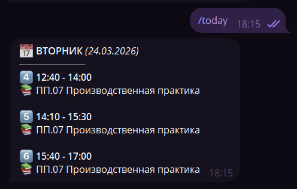
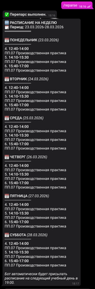
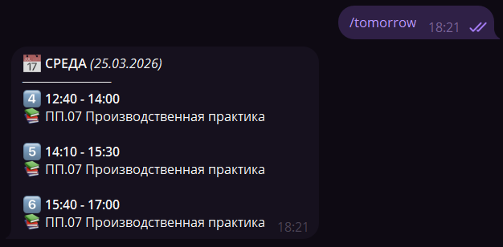

# Telegram-бот расписания АИТ

Бот автоматически забирает PDF-расписание с сайта колледжа, парсит его, сохраняет в SQLite и рассылает обновления в зарегистрированные чаты Telegram.

## Что умеет

- Проверяет сайт по расписанию и находит новый PDF с расписанием.
- Безопасно скачивает PDF в `downloads/` с проверкой расширения, хеша и валидности файла.
- Парсит расписание для одной группы из PDF через координатный парсер, устойчивый к кривым таблицам.
- Хранит несколько недель и выбирает нужную по целевой дате.
- Отправляет расписание на сегодня, на следующий учебный день и полное недельное обновление.
- Рассылает вечернее сообщение на следующий учебный день в `19:00`.
- Разрешает ручное обновление `/update` и принудительный перепарс `/reparse` только администраторам.

## Как это выглядит

Бот рассчитан на простой сценарий: пользователь пишет команду в Telegram и получает уже очищенное расписание без PDF-мусора, склеенных ячеек и обрывков слов.

### `/today` в личных сообщениях



### Недельное обновление после парсинга нового PDF

[Полный размер](docs/SCREENSHOTS/02_week_update.png)



### `/tomorrow` в личных сообщениях



## Структура проекта

```text
raspisanie_bot_ait/
├── main.py
├── bot.py
├── config.py
├── database.py
├── requirements.txt
├── .env.example
├── middleware/
│   └── access_middleware.py
├── models/
│   └── lesson.py
├── parser/
│   ├── lesson_extractor.py
│   ├── subject_alias_catalog.py
│   └── schedule_parser.py
├── scraper/
│   ├── atomic_file.py
│   ├── link_finder.py
│   └── schedule_scraper.py
├── services/
│   ├── schedule_service.py
│   └── schedule_updater.py
├── tests/
│   └── test_project_hardening.py
└── downloads/
```

## Ключевые модули

### `main.py`

Точка входа. Загружает `.env` и запускает `bot.main()`.

### `bot.py`

Основная логика бота:

- команды `/start`, `/today`, `/tomorrow`, `/update`, `/reparse`;
- форматирование сообщений;
- планировщик фоновых задач;
- восстановление состояния при старте;
- выбор следующего учебного дня с пропуском воскресенья;
- сброс накопившихся pending updates при старте polling.

### `config.py`

Чтение настроек из переменных окружения:

- `BOT_TOKEN`
- `GROUP_NAME`
- `ADMIN_IDS`

### `database.py`

Слой доступа к SQLite:

- одно общее соединение;
- идемпотентный `connect()`;
- таблицы `chats`, `schedule`, `metadata`;
- выбор нужного `week_period` по дате, а не по последней вставленной записи.

### `services/schedule_updater.py`

Оркестрация обновления расписания:

- получение списка ссылок;
- фильтрация лишних файлов;
- скачивание PDF;
- парсинг и сохранение;
- запуск рассылки при новом расписании.

### `services/schedule_service.py`

Отправка сообщений:

- рассылка по всем зарегистрированным чатам;
- удаление чатов, где бот заблокирован;
- уведомления администраторам с throttle;
- отправка PDF и текста отдельными сообщениями, без длинного `caption`.

### `scraper/schedule_scraper.py`

Асинхронный скрапер:

- получает HTML страницы расписания;
- извлекает ссылки на файлы;
- безопасно сохраняет только `pdf`;
- защищается от path traversal через имя файла.

### `parser/schedule_parser.py`

Координатный PDF-парсер:

- извлекает период недели;
- находит блок нужной группы по левому столбцу;
- собирает ячейки по координатам и `chars`, а не через `extract_tables()`;
- мержит данные группы по нескольким страницам.

### `parser/subject_alias_catalog.py`

Каталог устойчивых сокращений предметов:

- нормализует частые сокращения колледжа;
- чинит типовые битые формы из PDF;
- упрощает поддержку без переписывания логики парсера.

### `parser/lesson_extractor.py`

Нормализует содержимое ячеек PDF:

- выделяет кабинет;
- чистит текст;
- убирает хвосты с преподавателями;
- применяет замены предметов.

## Поток данных

```text
1. scraper.get_schedule_links()
2. services.schedule_updater.filter_links()
3. scraper.download_file()
4. parser.schedule_parser.parse()
5. parser.subject_alias_catalog.normalize_subject_alias()
6. database.save_schedule()
7. services.schedule_service.broadcast_message()
```

## Команды бота

- `/start` — регистрирует чат, если команду вызвал администратор.
- `/today` — показывает расписание на сегодня.
- `/tomorrow` — показывает расписание на следующий учебный день.
- `/update` — вручную запускает обновление расписания. Доступно только `ADMIN_IDS`, с простым throttle.
- `/reparse` — принудительно перепарсивает текущий PDF, даже если хеш файла не изменился. Доступно только `ADMIN_IDS`.

## Доступ и регистрация чатов

- Бот отвечает только в зарегистрированных чатах и администраторам.
- Новый чат может зарегистрировать только пользователь, чей Telegram ID указан в `ADMIN_IDS`.
- Если `/start` отправит не админ в незарегистрированном чате, бот ответит, что регистрация ограничена.
- После регистрации чата бот может отвечать всем участникам на обычные команды чтения расписания.
- Ручное обновление `/update` и `/reparse` разрешено только администраторам.

## Переменные окружения

Создайте `.env` на основе `.env.example`.

```env
BOT_TOKEN=ваш_токен_от_BotFather
GROUP_NAME=ИСП-3-22
ADMIN_IDS=Ваш ID телеграм акка (типа 123456789)
```

### Примечания

- `BOT_TOKEN` обязателен.
- `ADMIN_IDS` — список числовых Telegram ID через запятую.
- `GROUP_NAME` должен совпадать с названием группы в PDF.

## Установка и запуск

### Windows / локальный запуск

```bash
python -m venv venv
venv\Scripts\activate
pip install --upgrade pip
pip install -r requirements.txt
python main.py
```

### Linux / Debian

```bash
python3.12 -m venv venv
source venv/bin/activate
pip install --upgrade pip
pip install -r requirements.txt
python main.py
```

## Запуск через systemd

Пример unit-файла:

```ini
[Unit]
Description=AIT Schedule Bot
After=network.target

[Service]
Type=simple
User=aitbot
Group=aitbot
WorkingDirectory=/opt/raspisanie_bot_ait
ExecStart=/opt/raspisanie_bot_ait/venv/bin/python /opt/raspisanie_bot_ait/main.py
Restart=always
RestartSec=10
Environment=PYTHONUNBUFFERED=1
NoNewPrivileges=true
PrivateTmp=true
ProtectSystem=full
ProtectHome=true

[Install]
WantedBy=multi-user.target
```

Команды управления:

```bash
systemctl daemon-reload
systemctl enable ait-bot
systemctl start ait-bot
systemctl status ait-bot
journalctl -u ait-bot -f
```

## База данных

Файл `bot_database.db` создаётся автоматически при первом запуске.

Таблицы:

- `chats` — зарегистрированные чаты и `message_thread_id`;
- `schedule` — строки расписания по неделям и дням;
- `metadata` — служебные значения: хеши, даты рассылок, throttle.

## Зависимости

- `aiogram` — Telegram Bot API
- `aiohttp` — HTTP-запросы
- `aiosqlite` — SQLite
- `apscheduler` — фоновые задачи
- `pdfplumber` — чтение PDF
- `beautifulsoup4` — разбор HTML
- `python-dotenv` — загрузка `.env`
- `aiofiles` — асинхронная работа с файлами
- `requests` — вспомогательная HTTP-зависимость

`requirements.txt` хранит закрепленные версии для воспроизводимого деплоя. Для планового обновления зависимостей меняйте `requirements.in`, пересобирайте pinned versions отдельным PR и прогоняйте тесты до выкладки.

## Проверки

Статическая компиляция:

```bash
python -m compileall .
```

Тесты:

```bash
python -m unittest discover -s tests -v
```

Сейчас тесты покрывают:

- идемпотентное подключение к БД;
- выбор корректной недели по дате;
- защиту от path traversal в имени файла;
- экранирование HTML в сообщениях;
- логику следующего учебного дня;
- раздельную отправку PDF и текста.

Дополнительные документы:

- [DEPLOY_DEBIAN11.md](docs/DEPLOY_DEBIAN11.md)
- [TEST_SCENARIOS.md](docs/TEST_SCENARIOS.md)

## Ограничения

- Парсер ориентирован на конкретную структуру PDF с сайта колледжа.
- Если структура таблицы в PDF изменится, потребуется доработка `schedule_parser.py`.
- Бот рассчитан на одну основную группу из `GROUP_NAME`.
